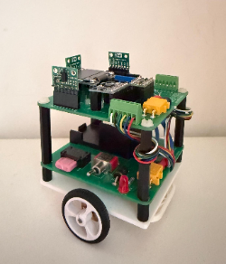
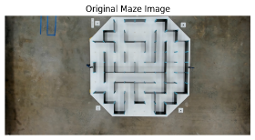
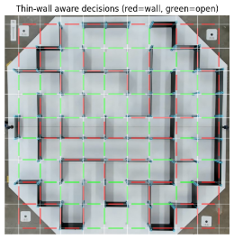
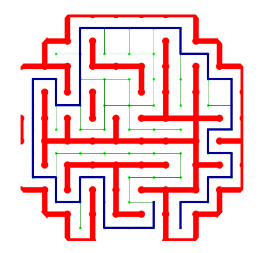
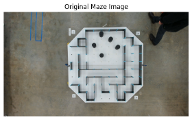
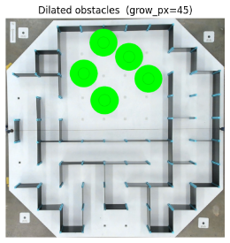
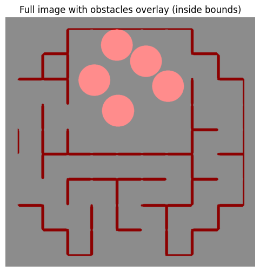
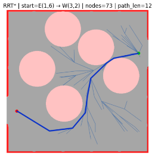
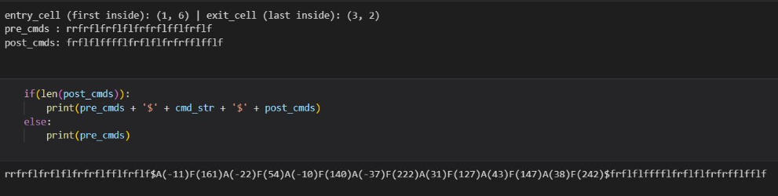
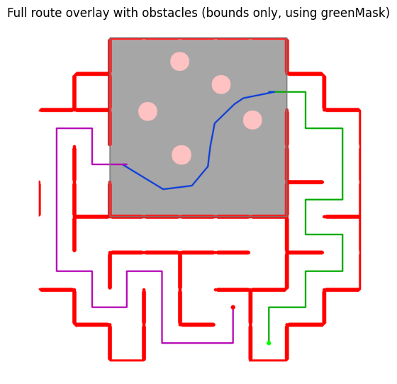

# Mickeyy (The micromouse)

This repository contains a complete micromouse(we call it mickeymouse out of love) stack:

- **On-board firmware (C++ / Arduino)** for low-level control, sensor fusion and motion primitives.
- **Off-board vision & planning (Python / OpenCV)** that converts overhead maze images into an optimal path and a compact command string executed by the robot.

Originally developed for a university micromouse competition, this project is structured and documented as a small production-style robotics system, suitable for extension to other maze or warehouse-style environments.



---

## Table of Contents

1. [Project Overview](#1-project-overview)  
2. [Hardware Platform](#2-hardware-platform)  
3. [Firmware Architecture](#3-firmware-architecture)  
   - [Shared State](#31-shared-state-sharedmemoryhpp)  
   - [Low-Level Drivers](#32-low-level-drivers)  
   - [PID Control](#33-pid-control-pidcontrollerhpp)  
   - [Motion Primitives](#34-motion-primitives-movementcontrollerhpp)  
   - [Main Control Loop](#35-main-control-loop-mickeyyino)  
4. [Vision & Path-Planning Pipeline](#4-vision--path-planning-pipeline)  
   - [Fixed-Grid Maze Planner](#41-fixed-grid-maze-planner--fixedgridplanneripynb)  
   - [Continuous Task Planner](#42-continuous-task-planner--continoustaskplanneripynb)  
5. [Example Mazes & Outputs](#5-example-mazes--outputs)  
6. [End-to-End Data Flow](#6-end-to-end-data-flow)  
7. [Getting Started](#7-getting-started)  
   - [Firmware](#71-firmware)  
   - [Vision & Planning](#72-vision--planning)

[Contributors and Acknowledgements](#contributors)

---

## 1. Project Overview

The micromouse robot is a two-wheel differential-drive platform that must autonomously:

1. **Navigate a rectilinear maze** with fixed walls.
2. **Traverse a continuous central area** containing cylindrical obstacles.
3. **Reach a designated goal cell** using a path generated from an overhead camera view.

Key features:

- Multi-sensor fusion (wheel encoders, IMU, three ToF LIDAR sensors).
- Robust wall, grid and obstacle detection from overhead images.
- A* path planning with turn-aware cost and path simplification.
- High-level motion primitives (cell-based and continuous) driven by PID control.
- A compact command language (`f/l/r` and `$A()F()$`) that decouples planning from execution.


---

## 2. Hardware Platform

**Controller**

- Arduino Nano (ATmega328P)

**Drive**

- 2 × DC motors, differential drive
- Wheel encoders on both sides
- Effective wheel radius: ~16 mm (configurable)

**Sensors**

- **IMU:** MPU6050 (I2C)  
  - Used for yaw (heading) estimation and 90° turns.
- **LIDAR:** 3 × VL6180X time-of-flight sensors  
  - Left, front, right for wall distance and lane centring.
- **Encoders:** quadrature encoders on each wheel  
  - Used for distance and velocity estimation.

**Typical Stack**

- **Embedded:** C++ on Arduino / AVR toolchain  
- **Host (vision/planning):** Python 3, OpenCV, NumPy, Matplotlib, Jupyter

Pin-level wiring and constants (PWM, direction pins, I²C addresses) are defined once in `SharedMemory.hpp` so the firmware can be retargeted to slightly different hardware without touching the control logic.

---

## 3. Firmware Architecture

The on-board code is written in C++ as a set of small, testable components.

### 3.1 Shared State (`SharedMemory.hpp`)

A centralised, thread-safe “blackboard” for the robot:

- **Configuration**
  - Motor pins, encoder pins, LIDAR enable pins and addresses.
  - Timing parameters (IMU and LIDAR sample periods, control loop assumptions).
  - Robot geometry (wheel radius, cell size).

- **Runtime state structures**
  - `IMUState` – yaw and orientation.
  - `LIDARState` – left, front and right distances.
  - `EncoderState` – raw encoder counts.
  - `WheelState` – per-wheel rotation and linear distance.
  - `WheelPWM` – commanded PWM values for each motor.
  - `SetpointState` – active linear and angular targets.
  - `ChainMode` – which primitive is currently active (front / left / right / adjustYaw).
  - `shiftMode` – handover flag between primitives.
  - `continuousMode` – toggles between discrete cell-based and continuous planning modes.

- **Atomic accessors**
  - `set/getIMUState`, `set/getLIDARState`, `set/getEncoderState`, `set/getWheelState`
  - `setWheelPWM` and `getLeftPWM`/`getRightPWM`
  - `setChainMode`, `getChainMode`
  - `setShiftMode`, `getShiftMode`
  - `setContinuousMode`, `getContinuousMode`
  - `setSetpointState`, `getSetpointState`

All setters and getters are wrapped in `ATOMIC_BLOCK` to prevent race conditions between interrupt service routines and the main loop.

---

### 3.2 Low-Level Drivers

**`Motor.hpp`**  
Encapsulates a single DC motor:

- Constructor: `Motor(uint8_t pwm_pin, uint8_t dir_pin)`
- `setPWM(int16_t pwm)`  
  - Sign determines direction; magnitude is clamped to a safe range and small PWM values are suppressed to avoid dead-zones.

---

**`Encoder.hpp`**  
Quadrature encoder driver:

- Interrupt-driven count updates from channels A/B.
- `getRotation()` converts tick counts to radians using a configurable `counts_per_revolution`.
- `getDistance()` multiplies rotation by wheel radius to obtain millimetres and updates `WheelState`.

---

**`IMU.hpp`**  
MPU6050 wrapper with simple sensor fusion:

- `calibrate()` performs IMU initialisation, gyro calibration and filter setup.
- `update()` reads raw accelerometer/gyro data, applies a 1D Kalman filter for roll/pitch and integrates gyro Z for yaw with bias compensation.
- `zeroYaw()` resets yaw offset for relative heading control.
- `getYaw()` returns the fused yaw value (degrees).

---

**`LIDAR.hpp`**  
VL6180X time-of-flight sensor abstraction:

- `LIDAR(uint8_t enPin, uint8_t i2cAddress)` sets enable pin and I2C address per sensor.
- `beginLidar()` powers up and initialises the sensor.
- `getDistance()` reads a distance sample (mm) and updates `LIDARState` in shared memory.

---

### 3.3 PID Control (`PIDController.hpp`)

A generic PID controller used across the system:

- `PIDController(float kp, float ki, float kd)`
- `float compute(float input)` computes control output from the current input, using `micros()` for timing.
- `void zeroAndSetTarget(float zero, float target)` sets a new reference frame and target while clearing integral and derivative history.
- `float getError()` exposes the current error for mode-switching logic.

Instances are used for:

- Per-wheel distance control (`pidL`, `pidR`).
- Heading control (`pidYaw`, `pidIMU`).
- Front wall distance (`pidFront`).
- Lane centring (`pidLane`).

Gains are tuned empirically for stable, slightly conservative behaviour on the real robot and are configurable at the top of `mickeyy.ino`.

---

### 3.4 Motion Primitives (`MovementController.hpp`)

High-level behaviours that orchestrate sensors, PIDs and motors:

- **`laneCentering(PIDController* pidLane, bool dir)`**  
  Maintains a constant lateral distance to the nearest wall (left/right) using side LIDAR and asymmetric PWM adjustments.

- **`frontWallStopper()`**  
  Monitors front LIDAR; when distance falls below a threshold the robot decelerates and stops, resetting the current chain state.

- **`headingControl(PIDController* pidIMU)`**  
  Small heading corrections using IMU yaw, with more aggressive corrections when `adjustYaw` is set. Used both for straight-line stability and to finalise turns.

- **`moveFront(PIDController* pidL, PIDController* pidR, PIDController* pidYaw)`**  
  Cell-based forward motion over an integer number of “cells” (e.g. 180 mm each). When encoder-based errors and PID outputs shrink below thresholds, the forward step is considered complete.

- **`turnLeft(...)` / `turnRight(...)`**  
  90° turns using IMU yaw and a dedicated PID. After the turn, yaw is re-zeroed and control is handed back to the next primitive.

- **`moveFollow(PIDController* pidFront)`**  
  Continuous forward motion for a specified distance (mm) based on the average wheel position. Used to execute longer, non-cell-aligned segments in continuous mode.

An internal finite-state machine tracks which primitive is running and when to transition based on PID errors and shared flags (`ChainMode`, `shiftMode`, `continuousMode`).

---

### 3.5 Main Control Loop (`mickeyy.ino`)

The `loop()` function performs:

1. **Sensor updates**
   - Encoders → distance.
   - IMU → yaw (at `IMU_INTERVAL`).
   - LIDAR → distances (at `LIDAR_SAMPLING_PERIOD`).

2. **Command interpretation**  
   A single global command string `cmd` defines the entire run:

   - **Discrete mode**: characters `f` (forward one cell), `l` (left 90°), `r` (right 90°). Multiple `f`s chain consecutive cells.
   - **Continuous mode**: a grammar of the form  
     `$A(angle)F(distance)A(angle)...F(distance)$`  
     where `A` is a turn in degrees and `F` is a straight-line distance in mm.

3. **Behaviour selection**  
   Based on `cmd` and internal flags, the controller:

   - Chooses the next primitive (e.g. `moveFront`, `turnLeft`, `moveFollow`).
   - Adjusts for walls using `frontWallStopper` and `laneCentering` when appropriate.
   - Uses `headingControl` to tidy up yaw between segments.

4. **Actuation**  
   At the end of each loop, the latest `WheelPWM` values from shared memory are applied to both motors.

---

## 4. Vision & Path-Planning Pipeline

All vision and planning components run off-board in Python / Jupyter notebooks and output a single command string to paste into `mickeyy.ino`.

### 4.1 Fixed-Grid Maze Planner – `fixedGridPlanner.ipynb`

Input: top-down maze image without cylinders.



Processing steps:

1. **Board detection & rectification**
   - Detect the outer board contour or four known corner tags.
   - Compute a homography and warp to an axis-aligned, square view.
   - Use Hough lines to refine global orientation.

2. **Illumination normalisation**
   - Convert to Lab colour space and operate on the L* channel.
   - Large-scale blurring and subtraction remove slow lighting variation to isolate walls.

3. **Wall segmentation**
   - Colour and intensity thresholds extract dark walls and cyan connectors from the bright board.
   - Morphological operations clean up noise to produce a binary wall mask.

4. **Grid estimation**
   - Cluster connector positions to infer row/column lines.
   - Generate a logical `N×N` cell grid aligned with the physical maze.

5. **Cell wall inference**
   - For each potential cell edge, probe a thin strip in the wall mask.
   - Decide whether a wall exists on each of the four sides (N/E/S/W) and build a `MazeWallMap`.
   
   

6. **Graph construction & A\* path planning**
   - Represent each cell as a node, connect neighbours if the separating wall is absent.
   - Run A* from start to goal, adding a small penalty for turns to prefer straighter paths.
   
   

7. **Command string generation**
   - Convert the path into a sequence of headings and cell steps.
   - Encode as compact `f/l/r` string, merging consecutive forward steps.

The resulting command string (e.g. `ffrfflff...`) is used in discrete chain mode.

---

### 4.2 Continuous Task Planner – `continousTaskPlanner.ipynb`

Input: maze image with cylindrical obstacles in the central area.



Processing steps (in addition to the fixed-grid pipeline):

1. **Cylinder detection**
   - Crop the central region.
   - Enhance contrast using CLAHE and Gaussian smoothing.
   - Use `cv2.HoughCircles` to detect circular obstacles.
   - Inflate detected cylinders by the robot footprint to create a safety buffer.

   

2. **Continuous planning window**
   - Define a rectangular window in cell coordinates covering the central area.
   - Preserve outer walls of the window while removing internal walls inside this region.
   - Rasterise the window into a fine occupancy grid where cells overlapped by inflated cylinders are marked as obstacles.

   

3. **Continuous A\* path**
   - Run A* on the fine grid from window entry to exit point (entry/exit are linked back to global cell coordinates).
   - Recover a polyline path in pixel coordinates.

4. **Path simplification and command extraction**
   - Apply Ramer–Douglas–Peucker (RDP) to simplify the polyline.
   - Convert segments to metric distances and headings using the known pixel-to-mm scale.
   - Round and filter tiny segments.
   - Encode as a sequence of `A(angle)F(distance)` commands.

   

5. **Global command assembly**
   - Compute:
     - `pre_cmds` – `f/l/r` path from maze start to the continuous window entry.
     - `post_cmds` – `f/l/r` path from window exit to final goal.
   - Assemble the final command string:

     ```text
     <pre_cmds>$A(...)F(...)A(...)F(...$)<post_cmds>
     ```

   

This string drives the full run, with the central `$…$` section executed in continuous mode and the rest in discrete mode.



---

## 5. Example Run


---

## 6. End-to-End Data Flow

**1. Overhead camera → image (JPEG/PNG)**  
&nbsp;&nbsp;&nbsp;&nbsp;↓  
**2. Python notebooks** (`fixedGridPlanner.ipynb`, `continousTaskPlanner.ipynb`)  
&nbsp;&nbsp;&nbsp;&nbsp;• Rectify board  
&nbsp;&nbsp;&nbsp;&nbsp;• Detect walls, grid and obstacles  
&nbsp;&nbsp;&nbsp;&nbsp;• Run A* path planning  
&nbsp;&nbsp;&nbsp;&nbsp;• Emit command string (`f/l/r` and `$A()F()$`)  
&nbsp;&nbsp;&nbsp;&nbsp;↓  
**3. Arduino firmware** (`mickeyy.ino` + headers)  
&nbsp;&nbsp;&nbsp;&nbsp;• Interpret command string  
&nbsp;&nbsp;&nbsp;&nbsp;• Execute sequence via motion primitives and PID loops  
&nbsp;&nbsp;&nbsp;&nbsp;• Use sensors for feedback (encoders, IMU, LIDAR)  
&nbsp;&nbsp;&nbsp;&nbsp;↓  
**4. Physical robot trajectory** in the maze/obstacle course.

This separation keeps planning and actuation loosely coupled and makes it easy to test the vision pipeline offline while iterating on control gains on the robot.

---

## 7. Getting Started

### 7.1 Firmware

1. **Clone repository**

   ```bash
   git clone https://github.com/darshan-k-s/micromouse.git
   cd micromouse/
   ```
2. **Install Arduino libraries**

   Via Sketch → Include Library → Manage Libraries… in the Arduino IDE:

   - MPU6050_light
   - VL6180X (Pololu)

3. **Open and configure**

   Open mickeyy.ino in the Arduino IDE.

   Select Tools → Board → Arduino Nano (ATmega328P).

   In the configuration section at the top of the file:

   - Confirm pin mappings match your wiring (PWM, DIR, encoder pins).
   - Confirm cell length and wheel radius if your mechanics differ.
   - Paste the latest command string generated by one of the notebooks into the cmd variable.

4. **Upload**
   
   - Connect the board via USB, select the correct serial port.

   - Compile and upload to the Nano.

   - Place the robot at the defined start cell and power on; the run is fully autonomous from that point.

---

### 7.2 Vision & Planning

Both planners are implemented as self-contained Jupyter notebooks. They share the same basic usage pattern:
- Put a top-down image of the maze in the repository.
- Open the relevant notebook.
- Adjust the configuration cell (start, goal, grid size if necessary).
- Run all cells.
- Copy the printed command string into mickeyy.ino.


## Contributors

- **Darshan K S**
- **Erin Shee**
- **Grace Murray**

## Acknowledgements

- MTRN3100 teaching staff at UNSW for providing the micromouse hardware platform and competition environment.
- Lab tutors and peers for feedback during testing sessions.
